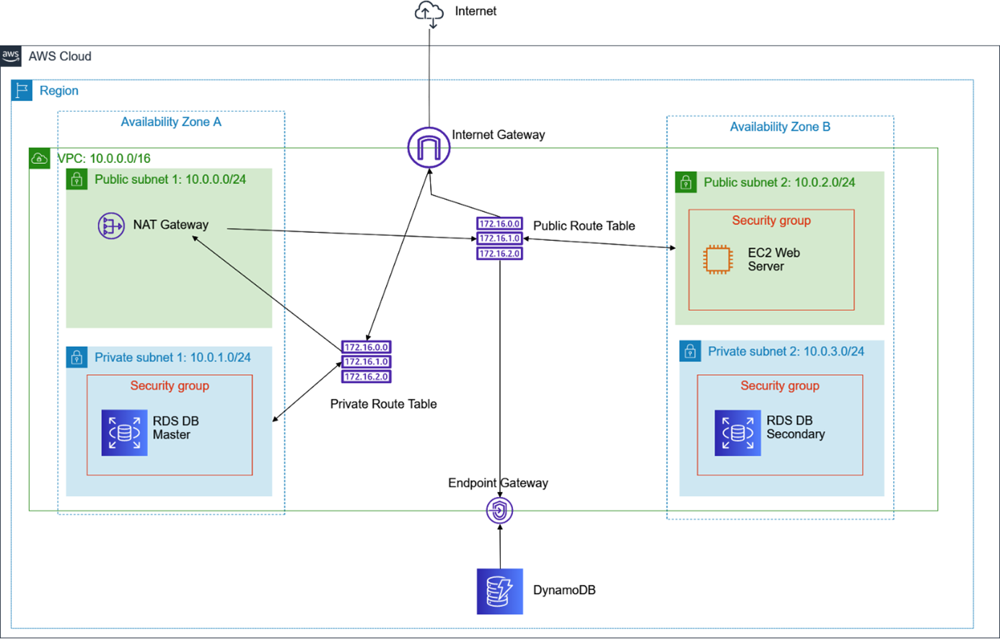
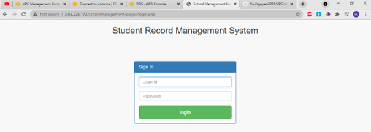
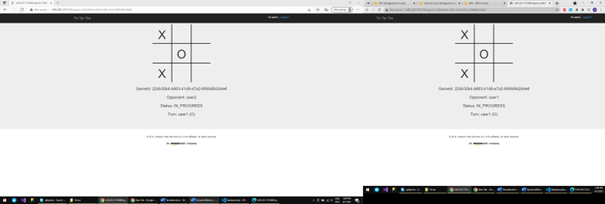

# VPC-Webserver-AWS

## Table of Contents
* [About The Project](#about-the-project)
* [Technologies Used](#technologies-used)
* [Setup](#setup)
* [Screenshots](#screenshots)
* [Usage](#usage)
* [Project Status](#project-status)
* [Room for Improvement](#room-for-improvement)
* [Acknowledgements](#acknowledgements)
* [Contact](#contact)
<!-- * [License](#license) -->

## About The Project
Create a VPC have:
   - 2 public subnet and 2 private subnet
   - 1 Linux EC2 for run a PHP web server "School Management"
   - 1 DynamoDB connect to EC2 and run Python Tic Tac Toe game

System Architect:

## Technologies Used
- AWS VPC
- AWS EC2
- AWS DynamoDB
- Amazon Linux 2
- LAMP mariadb 10.2 php 7.2
- Python, Flask

### Setup
_Following "./Reprot/Đề tài VPC - DynamoDB.docx"_

## Screenshots
PHP School Management:

Python Tic Tac Toe:

## Project Status
Project is: _complete_

## Acknowledgements
This project was based on:
- Tutorial: AWS Academy Lab - Lab2: Build a VPC and Launch a Web Server
- Tutorial: [DynamoDB example application using the AWS SDK for Python (Boto): Tic-tac-toe](https://docs.aws.amazon.com/amazondynamodb/latest/developerguide/TicTacToe.html)
- PHP School Management source code by [ANUJ KUMAR](https://phpgurukul.com/student-record-system-php/)
- Python Tic Tac Toe source code by [AWS](https://docs.aws.amazon.com/amazondynamodb/latest/developerguide/TicTacToe.Phase1.html)

## Contact
- [Vũ Nguyễn](https://github.com/vunguyen22271)
